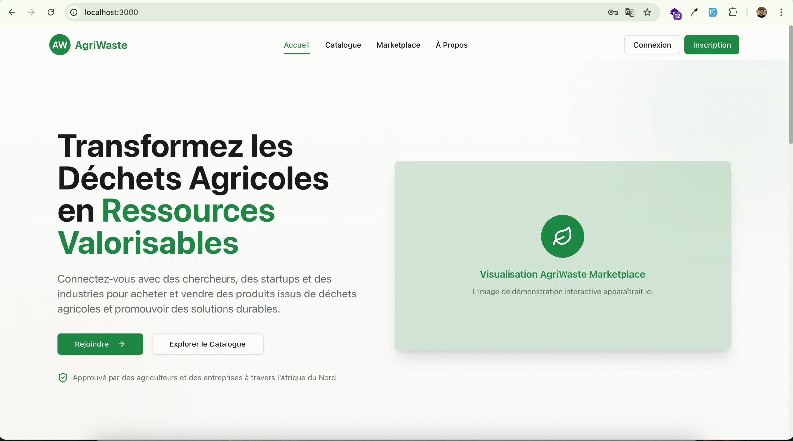
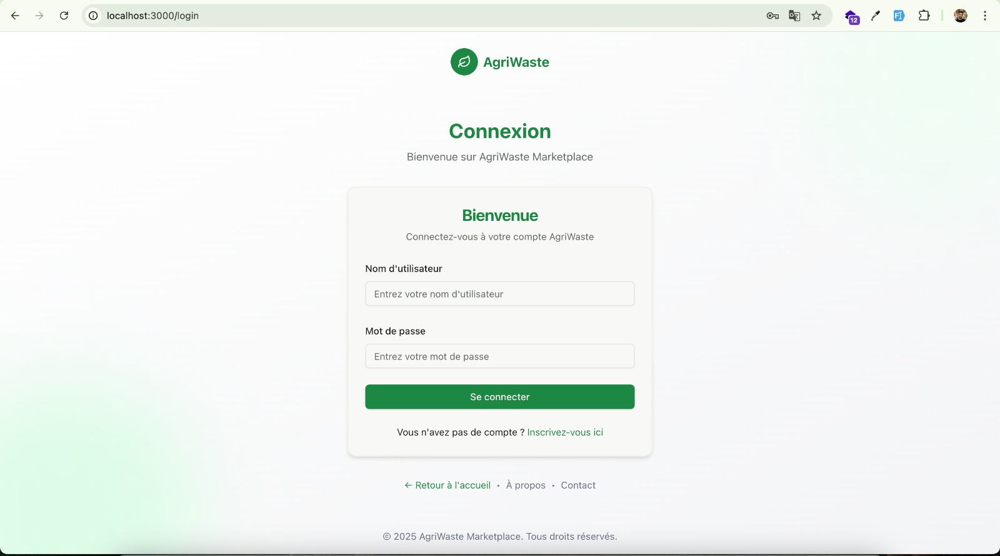
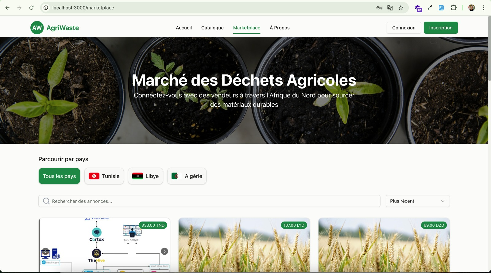
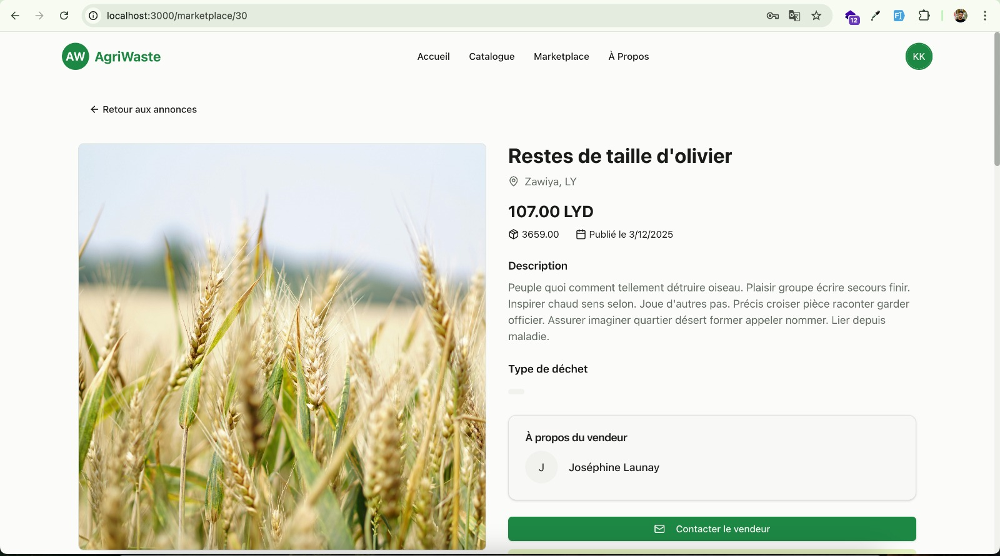
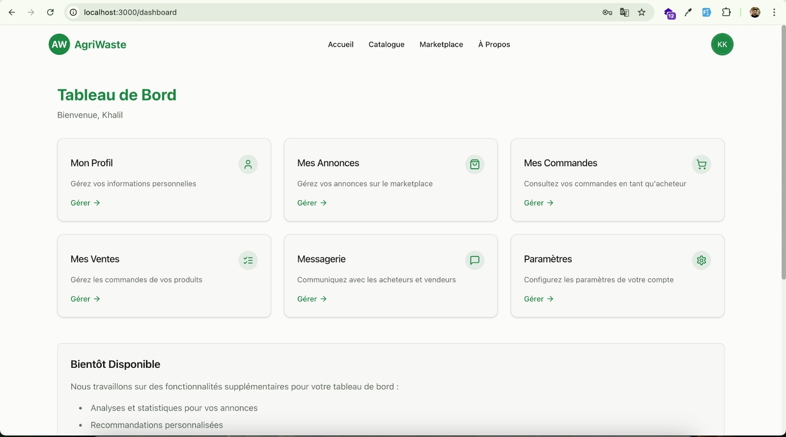
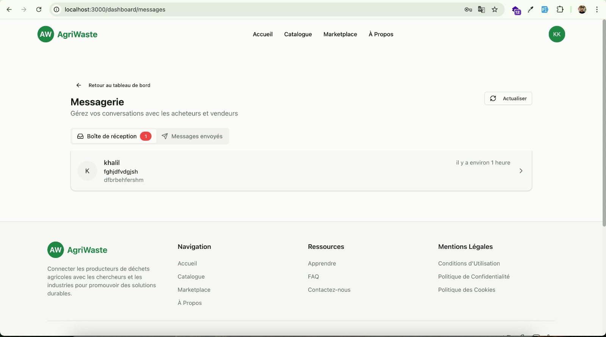
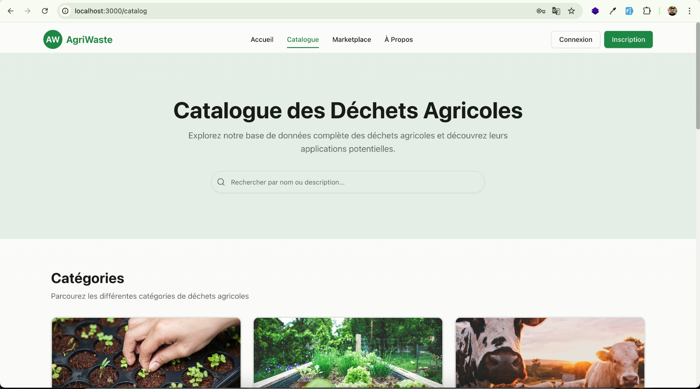
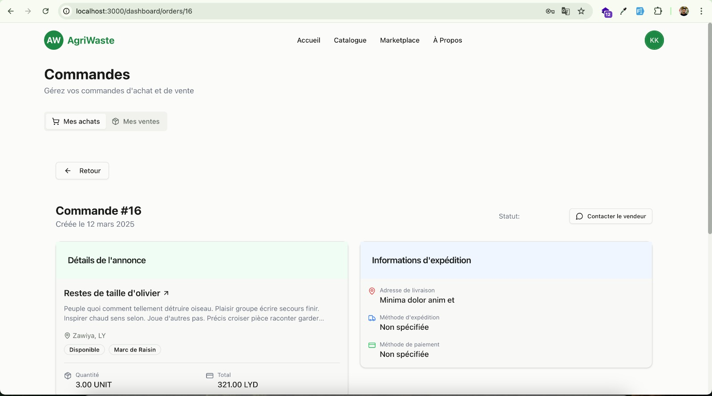

# AgriWaste Platform

<div align="center">
  
  <p><em>Transforming agricultural waste into valuable resources</em></p>
</div>

## 🌱 About AgriWaste

AgriWaste is an innovative marketplace platform that connects farmers with industries, researchers, and startups to facilitate the valorization of agricultural waste. The platform enables farmers to sell their agricultural waste, which can be transformed into valuable resources, contributing to a circular economy and sustainable agricultural practices.

## ✨ Key Features

### 🔐 Authentication & Profile Management
- Multi-role user registration (Farmers, Researchers, Startups, Industries)
- Secure JWT-based authentication
- Comprehensive profile management
- User preference settings

<div align="center">
  
</div>

### 🛒 Marketplace
- Browse waste listings with pagination
- Filter by country (Tunisia, Libya, Algeria)
- Keyword search functionality
- Detailed listing views with images
- Sort by date, price, and location

<div align="center">
  
</div>

### 📝 Listing Management
- Create detailed listings with comprehensive forms
- Multiple image uploads
- Edit and delete listings
- Listing status management (active, sold, expired)
- Personal listing dashboard

<div align="center">
  
  
</div>

### 💬 Messaging System
- Private conversations between buyers and sellers
- Comprehensive messaging interface with history
- Separate views for received/sent messages
- Unread message indicators
- Reply directly from detailed view

<div align="center">
  
</div>

### 📘 Information Pages
- Interactive homepage with platform overview
- Learning resources on waste valorization
- FAQ with common questions
- Contact form
- Legal pages (About Us, Terms of Use, etc.)

### 🖥️ User Interface
- Responsive design (mobile, tablet, desktop)
- Intuitive navigation with main menu and footer
- Custom theme with reusable components
- Smooth animations and transitions
- User feedback for actions

<div align="center">
  
  
</div>

## 🛠️ Technologies Used

### Frontend
- Next.js 14
- React
- TypeScript
- Tailwind CSS
- Framer Motion (animations)
- Axios (API requests)
- ShadcnUI (component library)

### Backend
- Django
- Django REST Framework
- PostgreSQL
- JWT Authentication
- Celery (task queue)
- Redis (caching)

## 🚀 Getting Started

### Prerequisites
- Node.js (v18 or higher)
- Python (v3.8 or higher)
- PostgreSQL
- Redis (optional, for caching)

### Installation

#### Frontend Setup
```bash
# Clone the repository
git clone https://github.com/khalef-khalil/agriWaste.git
cd agriwaste/frontend

# Install dependencies
npm install

# Start the development server
npm run dev
```

#### Backend Setup
```bash
# Navigate to the backend directory
cd ../backend

# Install dependencies and create virtual environement
pipenv shell

# Apply migrations
python manage.py migrate

# Create a superuser
python manage.py createsuperuser

# Start the development server
python manage.py runserver
```

## 🌍 Environmental Impact

AgriWaste aims to make a significant environmental impact by:

- Reducing agricultural waste going to landfills
- Enabling the transformation of waste into valuable resources
- Promoting sustainable agricultural practices
- Creating economic opportunities for farmers
- Fostering innovation in waste valorization technologies

## 📄 License

This project is licensed under the MIT License - see the LICENSE file for details.

## 👥 Contributing

Contributions are welcome! Please feel free to submit a Pull Request.

---

<div align="center">
  <p>Developed with ❤️ for a sustainable future</p>
</div> 